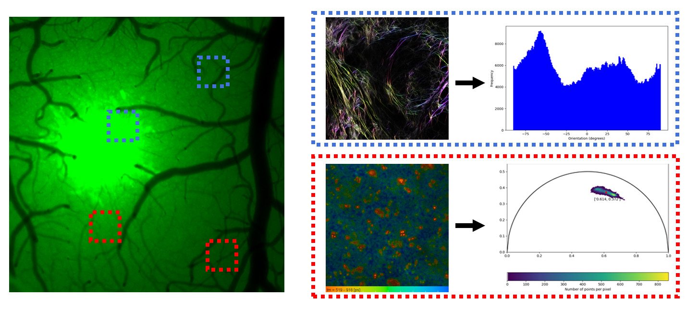

# Project describtion

The major part of the image analysis targets the data acquired using the label-free methods. 

It is crucial to postulate your hypothesis, type of data and statistical testing before you start with the experiment.

## Data analysis workflow on Bruker Ultima images

The Bruker Ultima project workflow is illustrated in the picture below:



The course experiemnt targets two hypothesis on Bruker Ultima data.

<strong> H<sub>01</sub>: There is no significant difference in the free/bound NADH ratio of the astrocytes at the tumor and the cortex.</strong> 

<strong> H<sub>02</sub>: There is no significant difference in fiber orientation at the tumor site and in the cortex.</strong>

## Data characteristics

### Fuorescence lifetime microscopy (FLIM)

The FLIM data originate from the endogenous fluorophore, coenzyme NADH. The fluorophore exists in its bound and free form and each form has a different lifetime. The overall lifetime of the two species reflects the metabolic acitivity pathway in the cells.

Becker and Hickl TCSPC software stores the lifetimes as 3D arrays where 3rd dimension is related to the number of time bins. The standard format is sdt file. 

```
...
├── ACPI2024
    ├── calibration
        ├── rhodamineB_in-methanol_ex805_1024x1024_px180_em610_05AOM_05_internal_001.sdt
        ├── erytrosineB_in-methanol_ex700_1024x1024_px180_em610_20AOM_10_internal_001.sdt
        ├── rhodamineB(1)+erytrosineB(9)_in-methanol_ex750_1024x1024_px180_em610_10AOM_10_internal_001.sdt
    ├── 240906_mouse_001_non_tumor
        ├── 1024x1024x256_FLIM_NADH_750nm_472-30.sdt
```
Download the FLIM data here: [Course 2024 FLIM data set](https://bioimaging.fgu.cas.cz/wp-content/uploads/2024/09/ACPI2024.zip)

### Second harmonic generation (SHG) signal images

The SHG signal returns a qualitative information about the type I collagen fibers. The signal is in squre relationship to the molecul present in the focal volume and the laser power.

Bruker Ultima stores the imags as 12-bit tif files with xml metadata:

```
...
├── ACPI2024
    ├── YYYYMMDD_mouse_001_tumor_GFP_tdTomato
        ├── mouse01_SHG_810nm-011.xml
        ├── mouse01_SHG_810nm-011_Cycle00001_Ch1_000001.ome.tif
        ├── mouse01_SHG_810nm-011_Cycle00001_Ch1_000002.ome.tif
```


