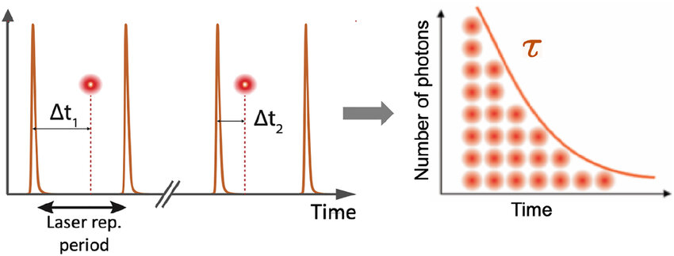
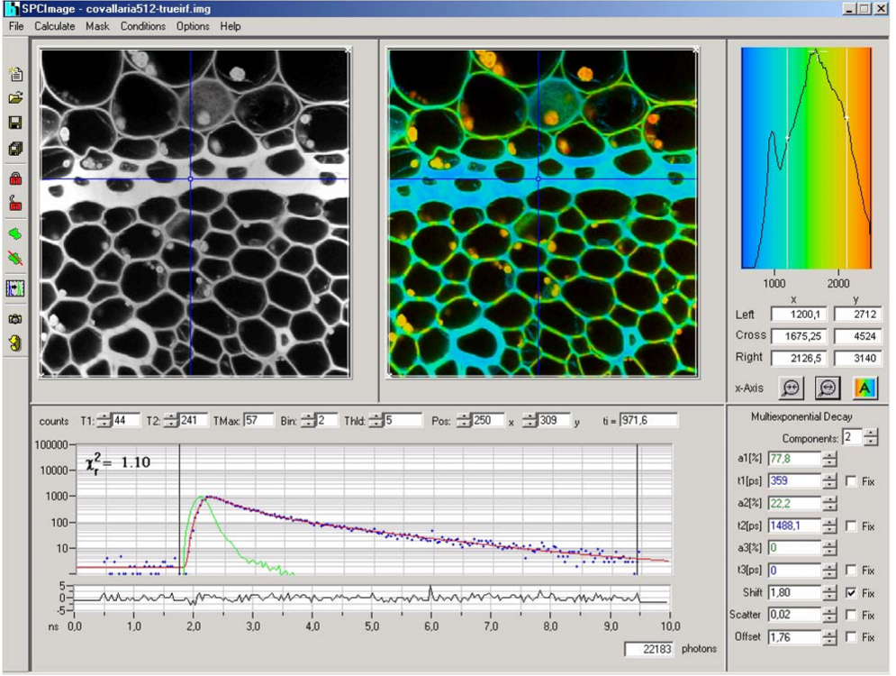
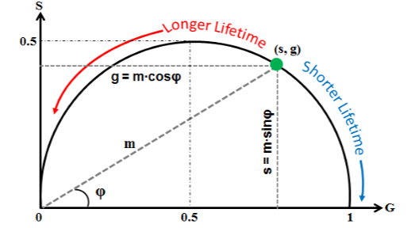
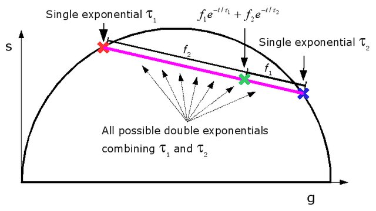

# Fluorescence lifetime microscopy (FLIM)

Time correlated single photon counting (TCSPC) detects single photons of a periodic light signal and determines the times of the photons after the excitation pulses.

## FLIM theory
### Fitting a model to the decay curve approach

A fluorophore decays with time according to the relation:

$$
I_{(t)} = A_0e^{-t/\tau_0}
$$

where $\tau_0$ is the fluorescence lifetime and $A_0$ is the amplitude.

To model more complex kinetics of fluorophores, the decay is usually model by a sum of exponentials:

$$
I_{(t)} = \sum_{i=1}^n A_ie^{-t/\tau_i}
$$

where $\tau_0$ is the fluorescence lifetime and $A_0$ is the amplitude.

The model fit can be done in specialized SW or by scripting.

### Phasor plot: the model-free approach

Representation of the fluorescence lifetime using the phasor plot model-free aproach. The phasor is a graphical representation of the transformed raw data.

The single decay component fluorophore sits on the universal circle and the position on the circle reflects the lifetime $\tau_0$ in respect with the laser repetition rate $\omega$.

The two phasors $g$ and $s$ are obtained through the transformation as:

$$
g_{(x,y)}(\omega) = \frac{\int I_{x,y}(t)\cos(\omega t)\,dt\,}{\int I_{x,y}(t)\,dt\,}
$$

$$
s_{(x,y)}(\omega) = \frac{\int I_{x,y}(t)\sin(\omega t)\,dt\,}{\int I_{x,y}(t)\,dt\,}
$$

The graphic represantation of the phasor is the universal semicircle with a point cloud of transformed decayes.

The complex micture of fluorescence specimen will be represented as a linear combination of those specimen in the universal semicircle.

## Code blocks for FLIM data phasor analysis

The B&H FLIM data can be analysed in Python using multiple libraries such as numpy, sdtfile and others. The practical examples are on the next pages.
